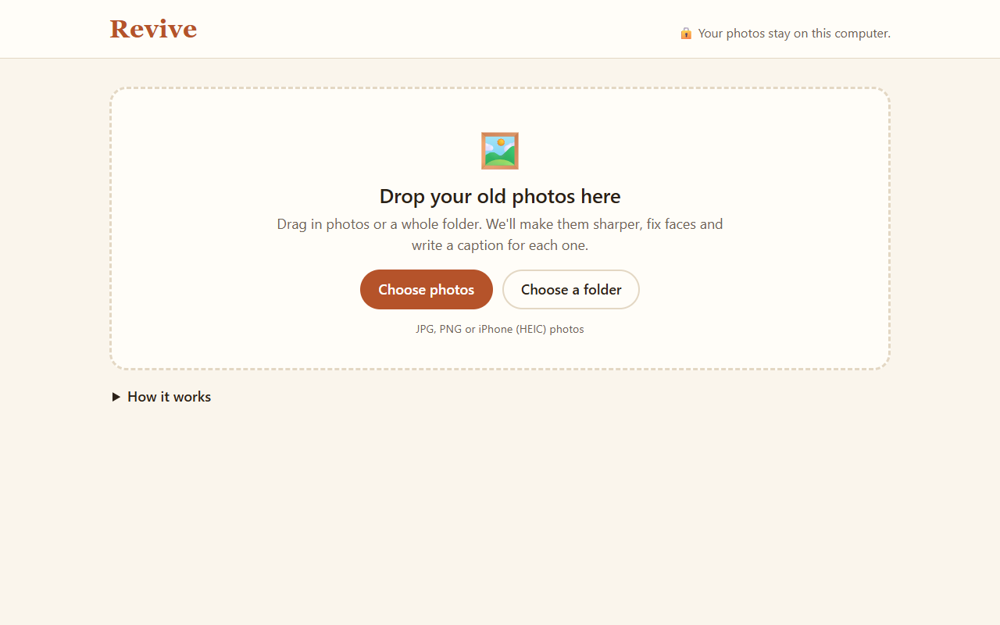
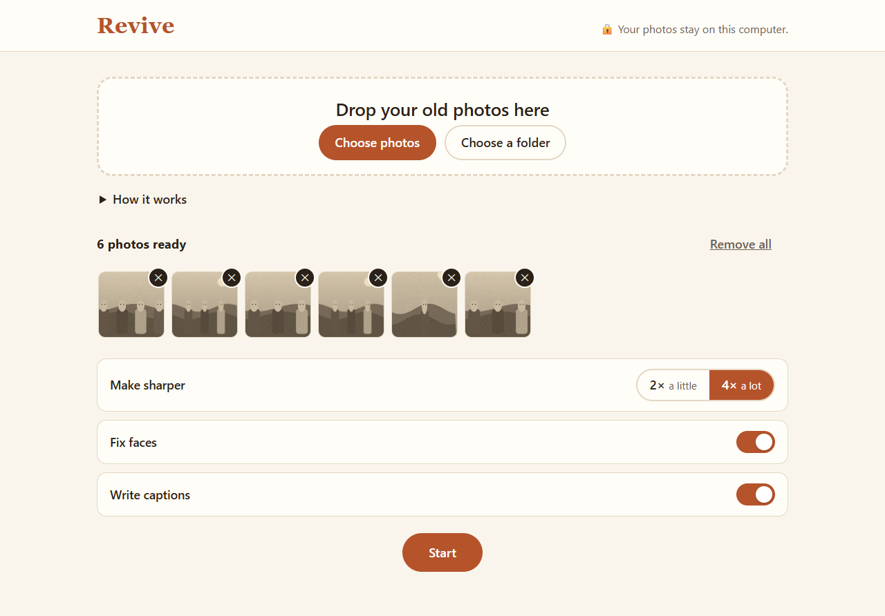
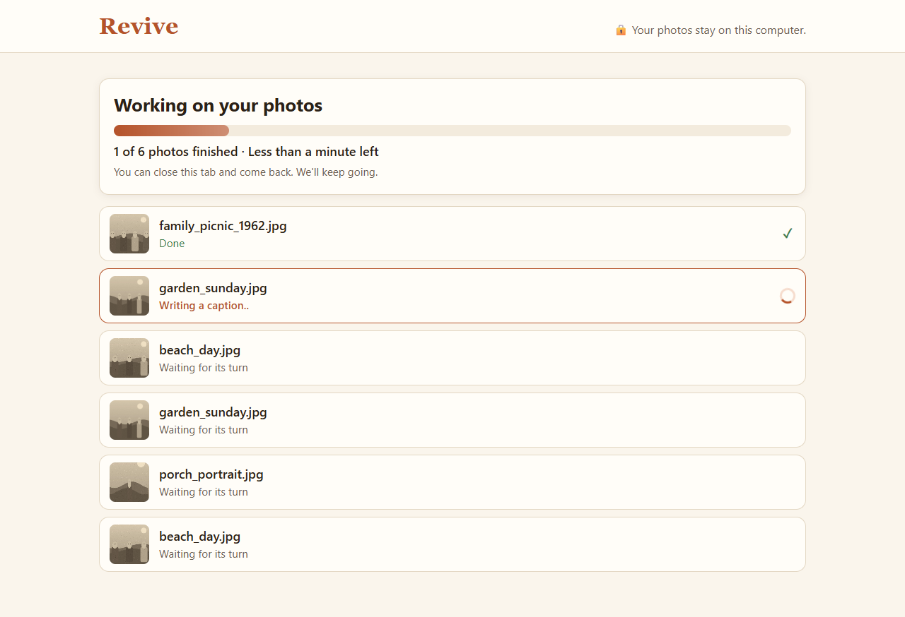
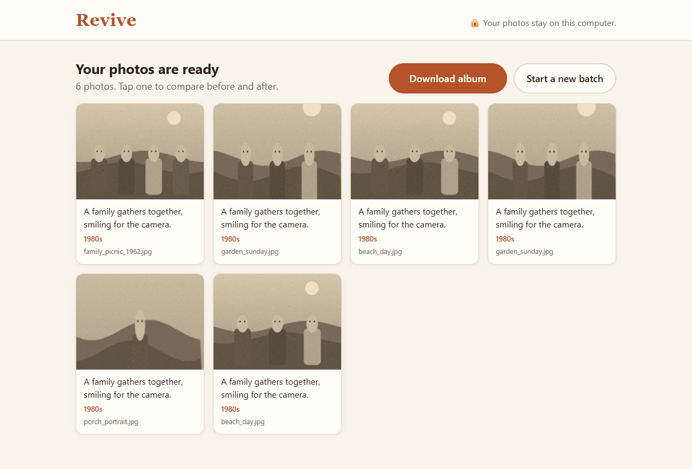
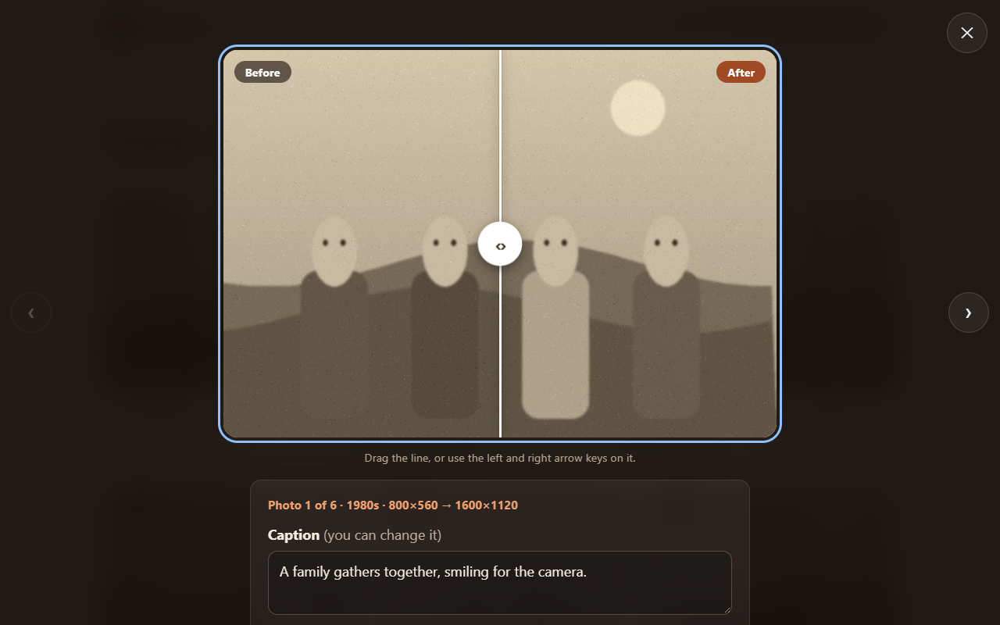

# Revive

Revive makes old family photos sharper, gently fixes blurry faces, and writes a short caption for each one.
When it's done, you get a little photo album you can open on any computer, even without internet.

**Your photos stay on this computer.** Nothing is uploaded anywhere. After the one-time setup, Revive works with the internet switched off.



## Setting it up (once)

You need two free programs first:

1. **Python**: download it from [python.org/downloads](https://www.python.org/downloads/) and install it.
   On Windows, tick the box that says **"Add python.exe to PATH"** on the first screen of the installer.
2. **Ollama**: download it from [ollama.com/download](https://ollama.com/download) and install it. This is what lets Revive write captions on your own computer.

Then set up Revive itself:

<!-- TODO(P3): scripts/setup.bat and scripts/start.bat for Windows are not written yet. -->
- **Windows:** open the `scripts` folder and double-click **`setup.bat`**.
- **Mac:** open the `scripts` folder and double-click **`Setup Revive.command`**. If your Mac says it can't be opened, right-click it, choose **Open**, then **Open** again.
- **Linux:** run `scripts/setup.sh` in a terminal.

Setup downloads about 7 GB the first time (the photo tools and the caption writer), so it can take 30 minutes or more on a slow connection. You'll see a line for each step. If something goes wrong, it tells you what to do. Running setup again is always safe: it skips everything that's already done.

## Using it (every time)

1. **Start it.** Windows: double-click **`start.bat`**. Mac: double-click **`Start Revive.command`**. Linux: `scripts/start.sh`.
   Your browser opens Revive by itself. Leave the small black window open while you use it.
2. **Add your photos.** Drag photos or a whole folder onto the page, or click **Choose photos**.
   JPG, PNG and iPhone (HEIC) photos all work.

   

3. **Choose and start.** Pick **2×** or **4×** under "Make sharper", leave "Fix faces" and "Write captions" on, and press **Start**.

   

4. **Look and compare.** Click any photo, then drag the line left and right to see before and after. You can change a caption if Revive got it wrong.

   
   

5. **Download the album.** Press **Download album**. You get a zip file; open it and double-click `album.html` to see your album. You can copy that folder to a USB stick or send it to family.

When you're finished, close the black window.

### How long it takes

Revive runs on your own computer, so it's slower than an online service. That's the price of keeping your photos private. On an ordinary laptop with no gaming graphics card:

- **2×** takes roughly **1 to 3 minutes per photo**. Use this for big batches.
- **4×** gives more detail but can take **several minutes per photo**, and much longer for big scans.
- Photos with **lots of people** take longer, because each face is fixed one by one (a class photo with 49 faces took about 5 minutes on its own).
- The **first caption** takes a little longer while the caption writer wakes up; after that it's about 5 seconds per photo.

You can leave it running and come back. Finished photos are saved as you go.

### If something goes wrong

- **"Please run setup first."** Run setup (see above), then start again.
- **A part is greyed out** (like "Write captions"): that tool isn't ready. Run setup again; it will tell you what's missing. Everything else still works.
- **"Write captions" is greyed out after a restart:** open the **Ollama** app, then start Revive again.
- **One photo says it couldn't be finished:** the others are fine. Check it's a real picture file (not a shortcut or a PDF) and try it again on its own.
- **It's very slow:** choose **2×**, and do 10 to 20 photos at a time.
- **The page doesn't open:** go to <http://localhost:8765> in your browser while the black window is open.

---

## For developers

Revive is a small local web app: a FastAPI server on `127.0.0.1:8765` serves a plain HTML/JS page and runs a job queue in a background thread. Every model runs on the user's machine.

### Stack

| Part | Choice |
|---|---|
| Server | Python 3.11+, FastAPI + uvicorn, bound to `127.0.0.1` only |
| Upscaling | [Real-ESRGAN](https://github.com/xinntao/Real-ESRGAN) `realesrgan-ncnn-vulkan` binary, model `realesrgan-x4plus`. Runs on any Vulkan GPU, integrated included |
| Face restore | [GFPGAN](https://github.com/TencentARC/GFPGAN) v1.4 on CPU (PyTorch CPU build), blend weight 0.5 |
| Captions | **Gemma 4** (`gemma4:e4b-it-qat`; `gemma4:e2b-it-qat` for low-RAM machines) via [Ollama](https://ollama.com) on localhost, with a JSON-schema `format` so it always returns `{caption, decade}` |
| Images | Pillow + pillow-heif (HEIC) |
| Frontend | Plain HTML/CSS/JS in `frontend/`, no build step |

### Pipeline

For each photo, in order: **original → faces** (GFPGAN, at original size) **→ upscale** (Real-ESRGAN 2× or 4×) **→ caption** (Gemma, on a ≤1024px copy of the original). `data/jobs/<job_id>/job.json` is written after every step, so a restart doesn't lose finished work. One bad photo never stops the batch: it is marked failed with a friendly message and the job moves on. If a tool isn't installed, that step is skipped for the whole job and the UI greys out its toggle.

The album (`GET /api/jobs/{id}/album`) is a zip with a self-contained `album.html`, `photos/`, `originals/` and `captions.json`. It makes no network requests.

### Run it

```bash
scripts/setup.sh                     # venv/, packages, Real-ESRGAN in bin/, weights in models/, Gemma via Ollama
scripts/start.sh                     # real mode on http://localhost:8765
REVIVE_GEMMA_MODEL=gemma4:e2b-it-qat scripts/start.sh   # swap the caption model with one env var
```

Setup notes: PyTorch is installed from the CPU wheel index rather than `requirements.txt`. `basicsr` 1.4.2 (a GFPGAN dependency) doesn't install on Python 3.13+, so `scripts/install_basicsr.py` patches its `setup.py` from the official sdist. GFPGAN's face detector weights are pre-fetched into `models/facexlib/`, so nothing downloads at run time.

Useful one-offs:

```bash
venv/bin/python -m backend.captions.try_captions samples/public/   # caption a folder, with timings
venv/bin/python -m backend.pipeline.faces samples/public/          # restore faces into samples/out-faces/
venv/bin/python -m backend.pipeline.try_upscale samples/public/ --scale 2
```

### Mock mode and tests

`scripts/dev.sh` starts the server with `REVIVE_MOCK=1`: the same API and progress, but no models (a Pillow resize, a copied photo and a canned caption). You can build and test the UI on any laptop with it.

```bash
venv/bin/python -m pytest tests -q
```

### Repo layout

```
backend/
  app.py, jobs.py, config.py     API, job runner, settings
  pipeline/upscale.py            Real-ESRGAN
  pipeline/faces.py              GFPGAN (+ --download-weights)
  captions/gemma.py              Gemma via Ollama
  album/                         album zip export
frontend/                        the page the user sees
scripts/                         setup / start / dev / demo recording
tests/
docs/                            handoffs, post notes, media
bin/ models/ data/ samples/      downloaded tools, weights, jobs, test photos (all gitignored)
```

### Licenses

Revive's own code is MIT (see `LICENSE`). The models and tools it downloads during setup keep their own licenses, and we don't redistribute any of them:
Real-ESRGAN is BSD-3-Clause, GFPGAN is Apache-2.0 (facexlib and basicsr too), and Gemma 4 is released under Apache-2.0.
The sample photos used during development are public domain; see `docs/media/sample-sources.md`.

### Team

Built for the DEV × Hacktoberfest 2026 Weekend Challenge, *Build for a Friend*, by `[DEV username P1]`, `[DEV username P2]` and `[DEV username P3]`.

Read the story behind it: `[DEV post link]`.
